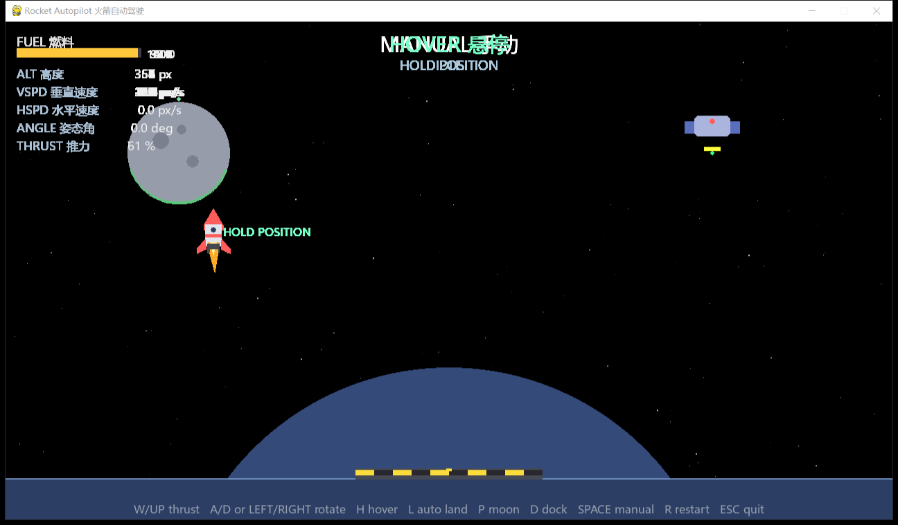

# Rocket Autopilot 火箭自动驾驶

A 2D rocket game with a real PID autopilot. Fly by hand, or let the ship
hover, land on the home planet's pad, land on the moon, or dock with the
space station — all automatically.

一个 2D 火箭游戏,内置真正的 PID 自动驾驶。你可以手动驾驶,也可以让飞船
自动悬停、自动降落到降落坪、自动登陆月球、自动对接空间站。



## Features 功能

- **Manual flight 手动飞行** — throttle and rotate with the keyboard.
- **Hover 悬停** — hold position and cancel all drift.
- **Auto landing 自动降落** — fly to the landing pad and touch down gently.
- **Moon landing 登陆星球** — climb, transit and land on the second planet.
- **Auto docking 自动对接** — approach the station and latch onto its port.
- Fuel management, gravity, touchdown physics (crash if too fast or tilted).
- Headless self-tests verify every autopilot mode (`--selftest`).

## Controls 操作

| Key 按键 | Action 功能 |
|---|---|
| `W` / `↑` | Thrust 主推力 |
| `A` / `D` / `←` / `→` | Rotate 旋转 |
| `H` | Hover 悬停 |
| `L` | Auto land on pad 自动降落 |
| `P` | Auto land on moon 登陆星球 |
| `D` | Auto dock 自动对接 |
| `Space` / `Backspace` | Back to manual 切回手动 |
| `R` | Restart (after landing/crash) 重新开始 |
| `Esc` | Quit 退出 |

Win the game by landing on the pad or docking with the station. Landing
anywhere on the planet also counts; crashing doesn't.

## Run 运行

```bash
pip install -r requirements.txt
python main.py
```

## Self-test 自测

```bash
python main.py --selftest
```

Runs every autopilot mode headlessly and asserts the expected outcome
(hover holds, pad landing, moon landing, docking).

## Build a Windows exe 打包

```bash
python tools/make_icon.py          # generate asset/rocket.ico (once)
pyinstaller --onefile --windowed --name RocketAutopilot --icon asset/rocket.ico main.py
```

The exe lands in `dist/RocketAutopilot.exe`. Verify it:

```bash
dist/RocketAutopilot.exe --selftest
```

Or just run `build.bat` on Windows to do all of the above.

## Project layout 结构

```
main.py               entry point (game loop, input, rendering)
game/config.py        physics & autopilot constants
game/rocket.py        rocket state and integration
game/autopilot.py     PID controller + phase state machine
game/world.py         planets, pad, station geometry
game/rules.py         touchdown & docking outcome rules
game/hud.py           rendering
game/selftest.py      headless autopilot verification
```

## How the autopilot works 自动驾驶原理

The rocket can only rotate and thrust along its own axis, so the autopilot
computes the net acceleration needed to steer toward a target state
(position error × kp + velocity error × kd), adds gravity compensation to
get the required engine acceleration, then turns the ship so its thrust
axis points along that vector and sets the throttle from the projection
onto it. Each mode is a small phase state machine (approach → descend →
touchdown / final approach) that only chooses the target state; the same
controller law flies every mode.

The self-tests simulate the exact same physics and rules code the game
uses, so `--selftest` passing means the autopilot genuinely lands and
docks, not just that the code runs.
